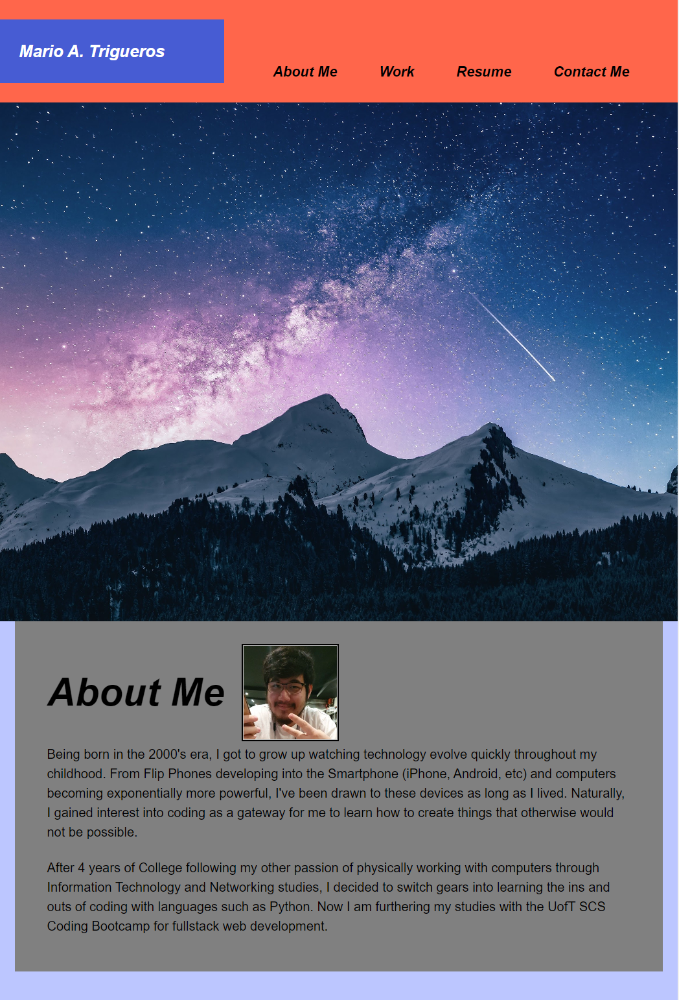
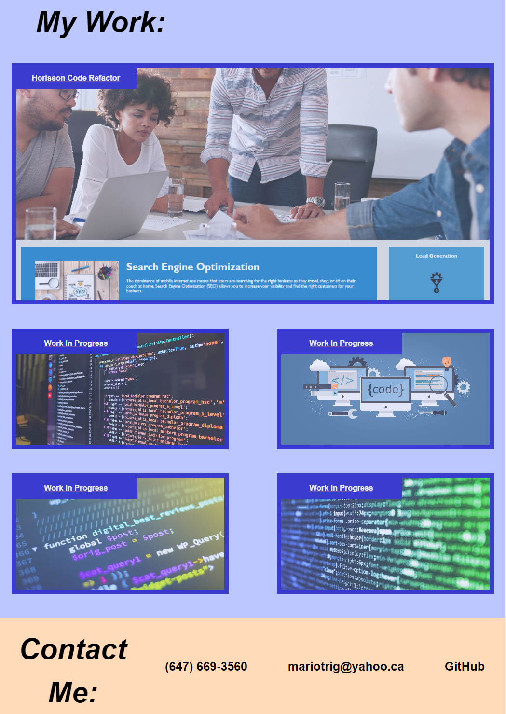

# Portfolio of Mario Trigueros

## Project Description
In this project, an online portfolio was constructed using HTML and CSS. This was achieved through the use knowledge of flexbox, header, footer, and other CSS elements. Among this, the webpage was prepared to adapt to changing window resolutions for more convenient viewing. HTML semantics and comments are used throughout the code to document the purpose of each block of code.

## Live Website

https://mariot573.github.io/Mario-Trigueros-Portfolio/

## Screenshots

